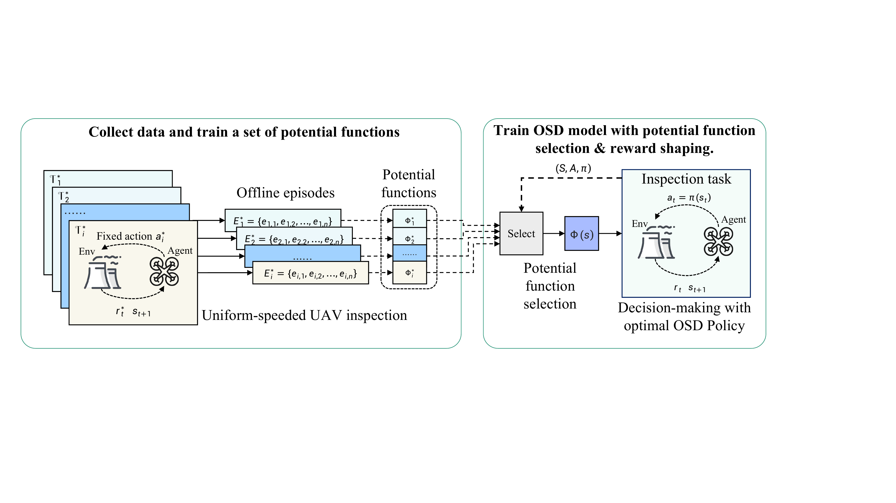
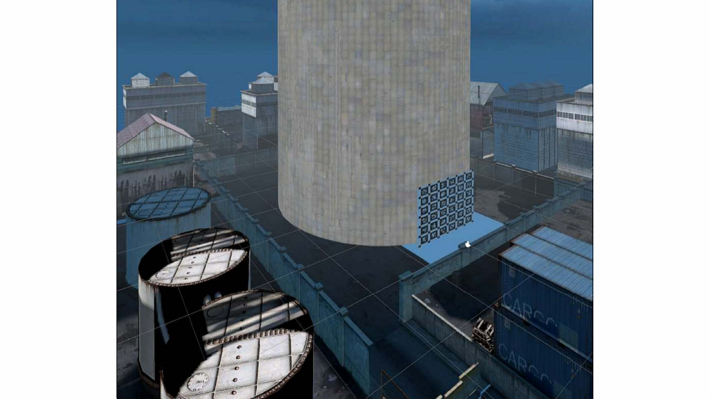
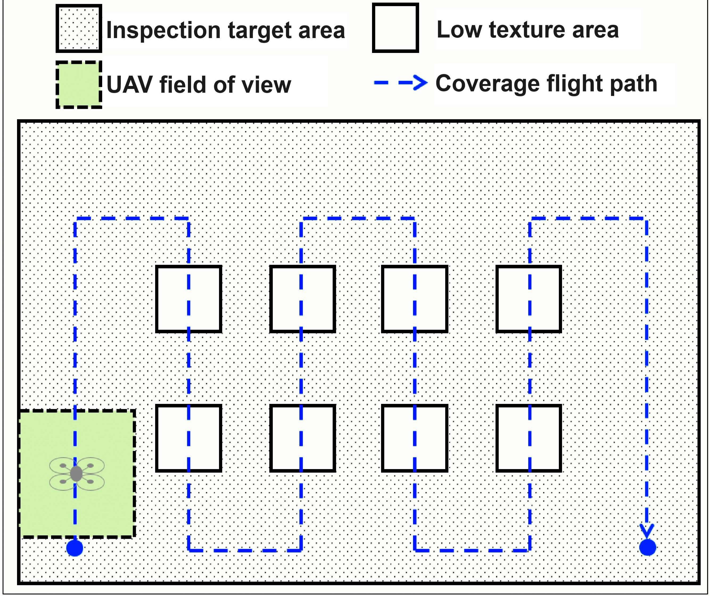
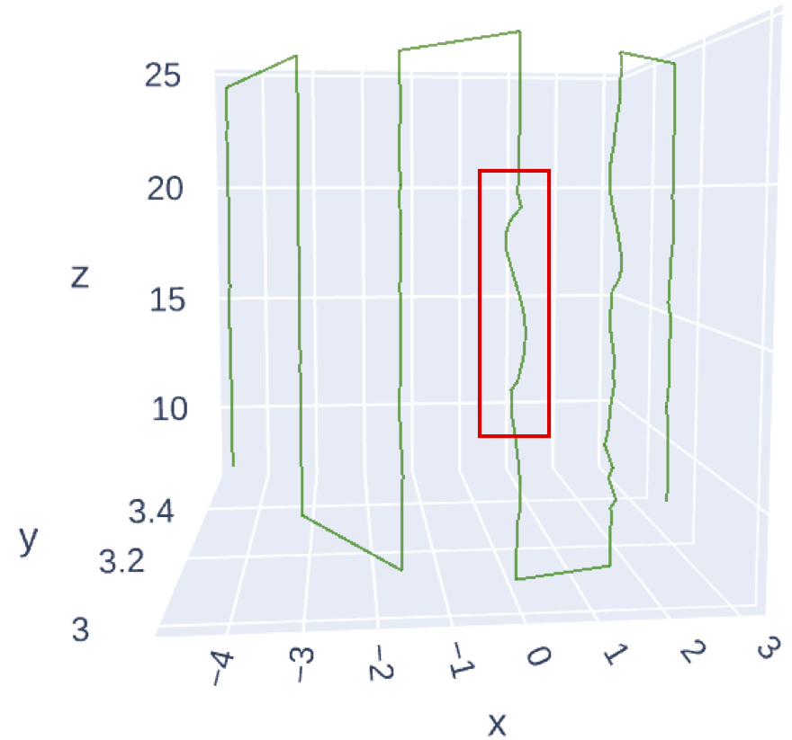
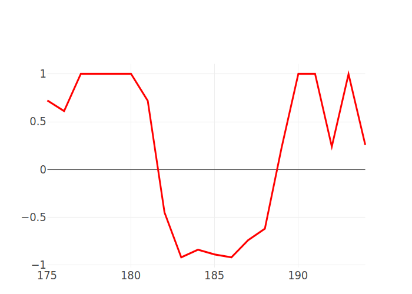
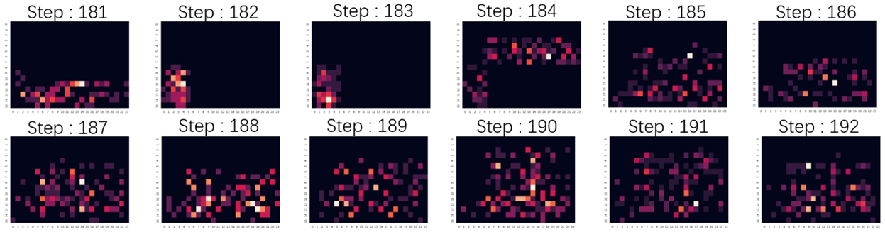
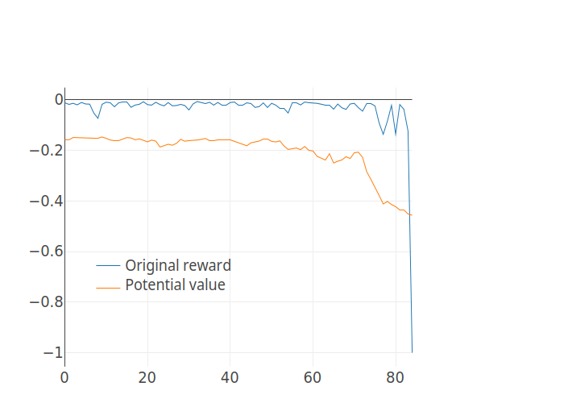
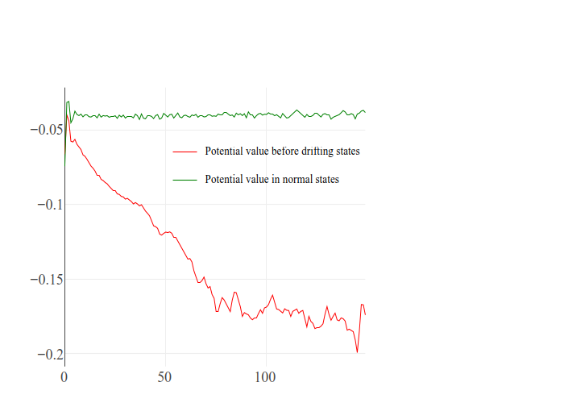

# Robust UAV Policy Learning for Urban Infrastructure Surface Screening

[](https://python.org)
[](https://pytorch.org)
[](https://www.ros.org/)
[](https://flightmare.readthedocs.io/)
[](https://github.com/UZ-SLAMLab/ORB_SLAM3)

> **Bingqing Du, Uddin Md. Borhan, Tianxing Chen, Jianyong Chen, Jianqiang Li, and Jie Chen**  
> College of Computer Science and Software Engineering, Shenzhen University  
> National Engineering Laboratory for Big Data System Computing Technology, Shenzhen University  
> Corresponding authors: **Jie Chen**, **Jianqiang Li**

---

## Overview

<p align="justify">
This repository presents a Deep Reinforcement Learning (DRL) framework for <b>autonomous UAV surface screening of urban infrastructure in GPS-denied environments</b>. The core objective is to enable a UAV to complete coverage inspection missions while balancing two competing requirements: <b>inspection efficiency</b> and <b>visual localization robustness</b>. In low-texture or visually degraded regions, aggressive motion can destabilize SLAM and increase drift; overly conservative motion, however, reduces operational efficiency. This work addresses that trade-off through a learned <b>Optimal Speed Decision (OSD)</b> policy and an <b>Off-Policy Critic-Based Reward Shaping (OP-CBRS)</b> strategy that improves learning under sparse rewards.
</p>

The framework addresses four tightly coupled challenges in autonomous inspection:

1. <b>GPS-denied coverage execution:</b> The UAV performs infrastructure-following coverage trajectories using visual-inertial localization rather than GPS.
2. <b>Scene-aware speed adaptation:</b> A learned OSD policy adjusts flight speed online according to observed feature richness, estimated motion quality, and sensor reliability.
3. <b>Sparse-reward mitigation:</b> OP-CBRS augments the original reward with potential-based shaping learned from offline uniform-speed inspection data.
4. <b>Robustness in low-texture regions:</b> The learned policy slows down when visual feature support degrades, helping stabilize localization and reduce path drift.

---

## Unified Inspection Pipeline

<p align="center">
  
</p>

<p align="justify">
The overall workflow first gathers offline experience from a set of uniform-speed inspection tasks, trains potential functions for those simpler tasks, and then uses the selected potential function to shape the reward during training of the online OSD policy. The final policy performs inspection-time speed adaptation while preserving the coverage objective and improving robustness against localization degradation.
</p>

---

## Method at a Glance

```text
Urban infrastructure inspection task
        |
        v
Coverage path planning
  - define inspection sector
  - generate snake-like coverage route
  - discretize route and set heading/orientation
        |
        v
Perception + localization
  - stereo camera image stream
  - IMU measurements
  - ORB-SLAM3 visual-inertial localization
  - visual feature map / matching distribution
        |
        v
State construction
  S = (X, v, b)
  X : visual-feature occupancy / binary feature map
  v : UAV velocity
  b : IMU bias / reliability cues
        |
        v
OSD policy (PPO actor-critic)
  action a_t = R_sight
  - scalar look-ahead / tracking radius
  - indirectly controls inspection speed
        |
        +---- immediate task reward
        |       r = R_g / R_d / (w_e r_e + w_g r_g)
        |
        +---- OP-CBRS shaping
                r' = r + f
                f(s_t, a_t, s_{t+1}) = gamma * Phi(s_t) - Phi(s_{t+1})
                Phi approximated from offline uniform-speed value functions
        |
        v
Trajectory tracking + closed-loop execution
  - move toward next route point
  - monitor RPE / drift
  - adapt speed in low-texture regions
```

---

## Technical Summary

### 1. Coverage Inspection Formulation

<p align="justify">
The inspection task is formulated as a waypoint-based coverage operation over an infrastructure surface. A set of waypoints is planned offline, and the UAV traverses piecewise paths between consecutive waypoints while collecting inspection-relevant visual data. The task is modeled as a Markov Decision Process (MDP), where the policy seeks to maximize cumulative reward while keeping the UAV close to the intended inspection trajectory under GPS-denied conditions.
</p>

<p align="justify">
A central difficulty is that faster motion improves mission throughput but may reduce the number and stability of visual features observed by the SLAM front-end, increasing localization drift. Slower motion generally improves feature tracking and pose quality, but lengthens task completion time. The learned policy therefore must solve a safety-efficiency trade-off rather than simply maximizing speed.
</p>

---

### 2. OSD Policy

<p align="justify">
The <b>Optimal Speed Decision (OSD)</b> model is the main decision-making component. Its state is defined as
<b>S = (X, v, b)</b>, where <b>X</b> is a binary visual feature map derived from feature matching in the SLAM front end, <b>v</b> is the UAV velocity, and <b>b</b> captures IMU bias information. This compact state representation preserves inspection-relevant cues while avoiding direct learning from raw high-dimensional images.
</p>

<p align="justify">
The action is a single scalar <b>R<sub>sight</sub></b>, the variable look-ahead radius used by the trajectory tracker. Since the controller tries to reach the next target point within a fixed step duration, changing <b>R<sub>sight</sub></b> directly changes the effective flight speed. In this way, the policy learns <b>continuous speed adaptation</b> rather than selecting from a few discrete flight modes.
</p>

<p align="justify">
The OSD policy uses a <b>PPO-based actor-critic architecture</b>. In the current implementation, the main policy path is a fully connected actor-critic network, while the notebook also contains CNN-based feature-processing variants for experimentation. The learned policy is trained over repeated coverage episodes, with each episode starting from a configured inspection origin and ending after waypoint completion or path deviation.
</p>

---

### 3. Reward Design

<p align="justify">
The reward combines trajectory correctness and progress efficiency. Terminal rewards are given when the UAV either <b>reaches the target waypoint</b> or <b>deviates from the intended route</b>. Outside those terminal conditions, the immediate reward is composed of two parts:
</p>

```text
r(s_t, a_t, s_{t+1}) =
    R_g                           if reached
    R_d                           if deviated
    w_e * r_e(s_t, s_{t+1}) +
    w_g * r_g(a_t)                otherwise
```

<p align="justify">
Here, <b>r_e</b> is an error reward based on relative pose error (RPE), encouraging motion that preserves localization quality, while <b>r_g</b> is a progress reward that depends linearly on the action and encourages efficient coverage execution. In practice, this means the policy is rewarded for moving efficiently, but not at the cost of unstable pose estimation.
</p>

---

### 4. Off-Policy Critic-Based Reward Shaping (OP-CBRS)

<p align="justify">
Because the original task reward is sparse, directly learning a strong speed-control policy can be inefficient. To address this, the framework introduces <b>Off-Policy Critic-Based Reward Shaping (OP-CBRS)</b>, which augments the original reward using a potential-function difference:
</p>

```text
r'(s_t, a_t, s_{t+1}) = r(s_t, a_t, s_{t+1}) + f(s_t, a_t, s_{t+1})

f(s_t, a_t, s_{t+1}) = gamma * Phi(s_t) - Phi(s_{t+1})
```

<p align="justify">
Rather than designing the shaping function manually, the method learns value functions for a set of <b>uniform-speed inspection tasks</b>. These offline tasks act as simpler proxies for the full coverage problem. During OSD training, the most appropriate potential function is selected based on the current behavior policy and recent action consistency, and that potential is used to provide additional learning signal. This improves data efficiency and helps the policy learn to avoid pre-drift states earlier.
</p>

<p align="justify">
Conceptually, OP-CBRS does two things: it reduces the burden of expert-crafted shaping, and it injects a predictive signal that can warn the agent about deteriorating localization conditions before large drift actually occurs.
</p>

---

### 5. Simulation Environment

<p align="justify">
The experimental platform integrates <b>Flightmare</b> for UAV simulation, <b>ORB-SLAM3</b> for visual-inertial localization, and <b>ROS</b> for communication between the agent, simulator, and SLAM stack. The paper evaluates the framework on a simulated <b>nuclear power plant containment shell</b> with realistic scale and texture patterns reconstructed from real surface imagery.
</p>

<p align="justify">
The inspection area is a cylindrical surface segment. The UAV maintains a fixed standoff distance and follows a snake-like up/down coverage pattern across the surface. Several low-texture regions are inserted intentionally to stress the localization stack and test whether the policy can adapt its speed to preserve pose quality.
</p>

---

## Visual Overview of the Task

<p align="center">
  
  &nbsp;
  
  &nbsp;
  
</p>

<p align="justify">
<b>Left:</b> Simulated infrastructure inspection scene centered on a containment-shell-like surface.  
<b>Center:</b> Inspection target area, field of view, low-texture zones, and the planned snake-like coverage route.  
<b>Right:</b> Reconstructed inspection path, illustrating how the UAV traverses the target surface to achieve full coverage.
</p>

---

## Decision Behavior Under Feature Degradation

<p align="center">
  
  &nbsp;
  
</p>

<p align="center">
  
</p>

<p align="justify">
These visualizations show the core behavior learned by the OSD policy. When the UAV enters a texture-deficient region, the visual feature heat map becomes sparse, the policy output shifts toward lower-speed decisions, and the 3D trajectory becomes more stable after transient fluctuation. This is the practical mechanism through which the policy trades efficiency for localization robustness only when necessary, rather than enforcing globally conservative motion.
</p>

---

## Reward-Shaping Diagnostics

<p align="center">
  
  &nbsp;
  
</p>

<p align="justify">
The potential-function diagnostics illustrate why OP-CBRS is useful. In drift-related episodes, the potential value begins to decrease <b>before</b> severe deviation becomes visible in the original sparse reward, indicating that the learned potential captures pre-failure signals. Over training, the separation between normal-flight states and pre-drift states improves, showing that the shaping model becomes increasingly effective at distinguishing safe and risky operating conditions.
</p>

---

## Code Tour

<p align="justify">
The current implementation is <b>notebook-centric</b>. The main codebase lives in <code>uav_inspetion_drl.ipynb</code>, which contains the end-to-end environment wrapper, trajectory generation utilities, PPO agent, offline reward-shaping pipeline, evaluation routines, and plotting code. The tour below follows the notebook in execution order and mirrors the paper’s pipeline.
</p>

### 1. RL Environment Encapsulation

**Notebook section:** `# Reinforcement Learning (RL) Env Code`

This section defines the low-level UAV and ROS integration:

- `UavController`  
  Encapsulates ROS node initialization, publisher/subscriber setup, and UAV commands such as arming, takeoff, landing, force-hover, pose commands, and velocity commands.
- `Env`  
  Wraps the simulation session, manages UAV controller lifecycle, resets, task trajectory setup, and SLAM launch/shutdown logic.

This block is the control bridge between the learning algorithm and the Flightmare/ROS runtime.

---

### 2. Test Environment and State Construction

**Notebook section:** `# TestEnv`

This section contains the online interaction logic used during policy learning:

- `avgPool10`, `avgPool30`  
  Feature-map pooling utilities for processing sparse visual-feature maps.
- `TestEnv`  
  The main training/evaluation wrapper around the simulator. It maintains estimated and reference poses, computes RPE, buffers state information, evaluates deviation, and executes step-level interaction.

Key responsibilities of `TestEnv` include:

- building the current state from visual feature distributions and IMU-related variables,
- tracking both estimated pose and reference/ground-truth pose,
- computing the error reward and progress reward,
- launching step execution in a background thread,
- deciding whether an experience is valid for replay,
- logging per-step diagnostic information for later analysis.

---

### 3. Inspection Path Initialization

**Notebook section:** `# Task Trajectory Initialization`

This part defines the inspection geometry and route generation utilities:

- `SetSectorDeg`, `SetSectorDeg_2`
- `SetSectorHeightRange`
- `GenRoutePointSet`
- `CoveragePathPlanner`, `CoveragePathPlanner_2`
- `DiscreteTraj`
- `FollowByLOS`, `FollowingTrajBySlam`

These functions define the inspection sector, convert the sector into turning points, generate the snake-like route across the surface, and discretize the route into executable tracking targets. This is where the high-level inspection mission is converted into a path that the controller and policy can follow.

---

### 4. Path-Following and Alignment Utilities

**Notebook section:** `# Inspection Path-Following Algorithm`

This block implements geometric helpers and tracking routines such as:

- line-to-segment distance calculation,
- next-point selection under a variable look-ahead radius,
- careful turning around curved surfaces,
- deviation checking,
- online alignment and re-alignment between SLAM and task coordinates.

These utilities are important because the OSD action does not directly command raw thrust; instead, it influences tracking speed through the trajectory-following mechanism.

---

### 5. PPO Agent

**Notebook section:** `# PPO Agent - Code Block`

This is the learning core of the repository. It includes:

- `build_mlp`
- `ActorCnn`, `CriticCnn`
- `ActorFc`, `CriticFc`
- `PPO_Config`
- `RunningMeanStd`, `Normalization`
- `AgentPPO`

The policy is implemented as an actor-critic PPO agent with both fully connected and CNN-style variants. The notebook uses normalization utilities for state stabilization and includes PPO essentials such as clipped policy updates, advantage estimation, entropy regularization, and optional learning-rate decay.

In practical terms:

- the actor maps the feature-map state and IMU-related state to a scalar action,
- the critic estimates state value,
- the action is later converted into an executable look-ahead / speed-related control variable for the environment.

---

### 6. Online Model Training

**Notebook section:** `# Model Training`

This stage performs online policy learning for the OSD model. A typical training cycle follows this pattern:

```text
1. reset simulator and SLAM stack
2. initialize inspection route
3. collect trajectory experience under the current PPO policy
4. compute task reward from RPE and progress
5. store valid transitions
6. update actor and critic with PPO
7. repeat across many iterations / episodes
```

The training loop is tightly coupled with the simulator, so the notebook acts as both experiment script and implementation source.

---

### 7. Offline Experience Collection

**Notebook section:** `# Offline Experience Collection`

OP-CBRS requires value-like potential functions learned from simpler tasks. This section collects offline data from <b>uniform-speed inspection policies</b>. Each fixed-speed policy generates trajectory experience that is later used to approximate potential functions for reward shaping.

This block is the bridge between the paper’s simpler proxy tasks and the main adaptive-speed policy.

---

### 8. Offline Potential Function Training

**Notebook sections:**  
- `# Offline Potential-Function Training - Fully Connected`  
- `# Offline Potential-Function Training - Convolutional`

These sections train the potential-function approximators used by OP-CBRS. The notebook includes both fully connected and convolutional variants, enabling experiments on different state encodings for value estimation.

This is where the repository implements the key idea that shaping rewards can be learned from offline data rather than designed fully by hand.

---

### 9. Evaluation and Uniform-Speed Comparison

**Notebook section:** `# Uniform-Speed Testing and Evaluation`

This section runs the comparison experiments reported in the paper:

- fixed uniform-speed inspection policies,
- the OSD policy without OP-CBRS,
- the OSD policy with OP-CBRS reward shaping.

It produces the metrics used to compare success rate, average execution time, and robustness-oriented behavior.

---

### 10. RPE Predictor and Auxiliary Analysis

**Notebook section:** `# RPE Predictor`

This optional section includes additional data processing and regression-style modeling around RPE prediction from windowed task data. It is helpful for analysis and diagnostics, though it is not the central policy-learning block.

---

### 11. Presentation and Figure Generation

**Notebook section:** `# Presentation Figure Generation`

The final plotting cells generate the visual results used in the paper and presentation materials, including policy response curves, feature heat maps, and potential-function analysis plots.

---

## Repository Layout

```text
robust-uav-surface-screening/
├── README.md
├── uav_inspetion_drl.ipynb              <- notebook-centric end-to-end implementation
├── figs/
│   ├── inspection.png                   <- OP-CBRS training / policy-learning pipeline
│   ├── exp0-a.png                       <- simulated inspection scene
│   ├── exp0-b.png                       <- target area / FOV / coverage pattern
│   ├── exp0-c.png                       <- reconstructed coverage path
│   ├── exp1-a.png                       <- 3D flight trajectory response
│   ├── exp1-b.png                       <- action decision curve
│   ├── exp1-c.png                       <- visual feature heat-map series
│   ├── exp2-1.png                       <- original reward vs potential value
│   └── exp2-2.png                       <- potential-function accuracy evolution
├── paper/
│   └── Robust_UAV_Policy_Learning_for_Urban_Infrastructure_Surface_Screening.pdf
├── checkpoints/                         <- trained OSD / phi-network weights (generated)
├── logs/                                <- ROS, SLAM, and experiment logs (generated)
└── results/                             <- exported metrics / plots / evaluation traces
```

<p align="justify">
The current uploaded materials are centered around a single notebook implementation. If you later refactor the notebook into Python modules, this README structure can still be preserved with only minor path changes.
</p>

---

## Experimental Setting

<p align="justify">
The reported experiments are conducted in a simulated containment-shell inspection environment. The simulator uses a stereo camera at <b>30 Hz</b> with image resolution <b>480×720</b>, and an IMU at <b>200 Hz</b>. The localization backbone is <b>VI-ORB-SLAM3</b> with loop closure disabled to avoid repeated-texture issues. The inspection area spans a <b>10 m</b> height and an <b>18 m</b> bottom arc length, and the UAV maintains an approximately <b>1 m</b> standoff distance from the target surface.
</p>

<p align="justify">
During training, the agent accumulates more than <b>100,000</b> experiences over <b>100</b> iterations. The paper reports a replay-buffer length of <b>1024</b>, batch size <b>512</b>, <b>16</b> replay passes, discount factor <b>0.95</b>, lambda factor <b>0.98</b>, PPO clipping value <b>0.25</b>, and learning rate <b>6×10<sup>-5</sup></b>.
</p>

---

## Requirements

This project assumes a robotics / simulation environment rather than a pure Python-only setup.

### Core dependencies

- Python
- PyTorch
- ROS
- Flightmare simulator
- ORB-SLAM3
- NumPy
- Jupyter Notebook

### Typical environment components

- Ubuntu-based development machine
- GPU-enabled PyTorch environment recommended
- ROS workspace configured for UAV control and message passing
- Flightmare scene assets and quadrotor interface
- ORB-SLAM3 configured for stereo-inertial processing

---

## Quick Start

### 1. Prepare the simulator stack

Make sure the following components are available and running correctly:

- ROS master
- Flightmare simulator
- UAV controller bridge
- ORB-SLAM3 stereo-inertial pipeline
- required custom ROS topics / messages for feature stream, pose, and control

---

### 2. Launch the notebook

```bash
jupyter notebook uav_inspetion_drl.ipynb
```

---

### 3. Run the notebook in logical order

Execute the notebook sections in this sequence:

```text
1. Reinforcement Learning (RL) Env Code
2. Flightmare Simulation Environment / TestEnv
3. Task trajectory initialization
4. Path-following algorithm
5. PPO Agent - Code Block
6. Model Training (online OSD training)
7. Offline Experience Collection (uniform-speed offline data)
8. Offline Potential-Function Training - Fully Connected / Convolutional (phi-function training)
9. Uniform-Speed Testing and Evaluation (evaluation)
10. RPE Predictor / Presentation Figure Generation (analysis and visualization)
```

---

### 4. Train the baseline OSD policy

Use the PPO training cells to launch online training with the original reward. This gives the adaptive-speed OSD policy without OP-CBRS shaping.

---

### 5. Collect uniform-speed offline data

Run the uniform-speed data-collection cells to generate offline trajectories for several fixed-speed inspection policies.

---

### 6. Train potential functions

Use the offline potential-function training blocks to learn the shaping functions required by OP-CBRS.

---

### 7. Train or evaluate the OP-CBRS-enhanced OSD policy

Run the evaluation cells to compare:

- fixed uniform-speed policies,
- OSD without reward shaping,
- OSD with OP-CBRS.

---

## Recommended Execution Workflow

| Stage | Goal | Main notebook components |
|---|---|---|
| Environment setup | connect ROS, simulator, and UAV controller | `UavController`, `Env` |
| State / interaction setup | build RL-facing inspection environment | `TestEnv`, feature pooling, callbacks |
| Route generation | create inspection path over infrastructure surface | `CoveragePathPlanner`, LOS utilities |
| Online policy learning | train OSD with PPO | `AgentPPO`, training cells |
| Offline shaping data | collect fixed-speed inspection experience | offline experience cells |
| Potential-function learning | fit phi-functions for OP-CBRS | phi training blocks |
| Evaluation | compare policies and generate figures | testing + plotting cells |

---

## Key Results

The paper compares several fixed uniform-speed policies against the learned adaptive-speed policy and the OP-CBRS-enhanced variant.

| Policy | Success Rate (%) | Avg. Execution Time (s) | Etime (s) |
|---|---:|---:|---:|
| Uniform speed 0.4 m/s | 50 | 358 | 716 |
| Uniform speed 0.6 m/s | 20 | 269 | 1345 |
| Uniform speed 0.8 m/s | 64 | 228 | 356 |
| Uniform speed 1.0 m/s | 77 | 208 | 270 |
| **OSD** | **83** | **220** | **265** |
| **OP-CBRS** | **90** | **228** | **253** |

<p align="justify">
The learned OSD policy achieves a better balance between robustness and efficiency than fixed-speed alternatives. Compared with the 0.8 m/s uniform policy, OSD improves success rate while also reducing average completion time. OP-CBRS further improves robustness by increasing success rate, even though it accepts a small execution-time increase to avoid pre-drift conditions more conservatively.
</p>

---

## Why the Method Works

<p align="justify">
The main strength of the framework is that it does not treat “flying faster” as universally good or bad. Instead, it learns when fast motion is safe and when deceleration is necessary. In texture-rich regions, the policy can sustain efficient progress. In texture-poor regions, it slows down to preserve feature tracking and reduce localization instability. OP-CBRS strengthens this behavior by providing a predictive shaping signal that becomes sensitive to pre-drift states before hard failure is observed.
</p>

---

## Practical Notes

**Notebook-first implementation**  
The current codebase is organized as a research notebook rather than a fully modular Python package. This is convenient for reproducing experiments, but it also means section execution order matters.

**Run cells in order**  
Because simulator objects, ROS publishers/subscribers, and learned models are created incrementally, skipping notebook sections can break later blocks.

**Figure rendering on GitHub**  
For inline GitHub preview, keep the figures in PNG format inside `figs/`. If some original assets are PDFs, export them to PNG using the same stem names for seamless rendering.

**Low-texture stress testing**  
The evaluation is most informative when the inspection surface includes deliberately texture-deficient regions. Those regions make the speed-adaptation behavior visually obvious.

**SLAM alignment matters**  
The notebook includes alignment and re-alignment utilities because reliable coordination between the SLAM frame and the task frame is critical for both reward computation and trajectory tracking.

---

## Future Directions

<p align="justify">
The current study validates the framework on a nuclear-power-plant-style containment shell. A natural next step is to extend the system to a broader range of urban infrastructures, such as bridges, tunnels, curved façades, towers, and high-rise surfaces with varying geometry and texture patterns. Additional future work could also refactor the notebook into a reusable package, add ablation scripts, and integrate real-world deployment logs.
</p>

---

## Citation

If you use this repository in your research, please cite the corresponding paper.

```bibtex
@inproceedings{du2024robustuavscreening,
  title     = {Robust UAV Policy Learning for Urban Infrastructure Surface Screening},
  author    = {Du, Bingqing and Borhan, Uddin Md. and Chen, Tianxing and Chen, Jianyong and Li, Jianqiang and Chen, Jie},
  booktitle = {Proceedings of ICARM},
  year      = {2024},
  note      = {Please update with the final bibliographic information of the published version}
}
```

---

## Acknowledgements

<p align="justify">
This work was supported in part by the National Natural Science Funds for Distinguished Young Scholar under Grant 62325307; in part by the National Natural Science Foundation of China under Grants 62073225, 62203134, and 62072315; in part by the Natural Science Foundation of Guangdong Province under Grant 2023B1515120038; in part by the Shenzhen Science and Technology Innovation Commission under Grants 20220809141216003, JCYJ20210324093808021, and JCYJ20220531102817040; in part by the Guangdong “Pearl River Talent Recruitment Program” under Grant 2019ZT08X603; in part by the Guangdong “Pearl River Talent Plan” under Grant 2019JC01X235; and in part by the Scientific Instrument Developing Project of Shenzhen University under Grant 2023YQ019.
</p>
